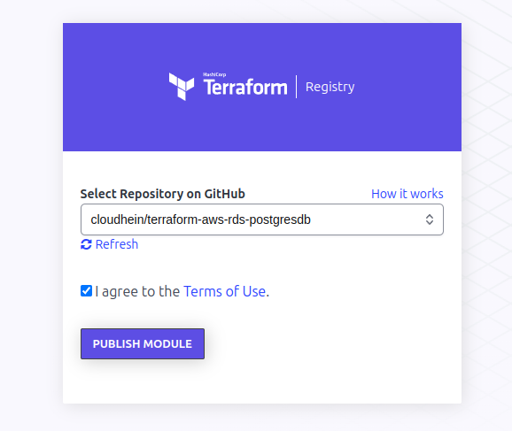
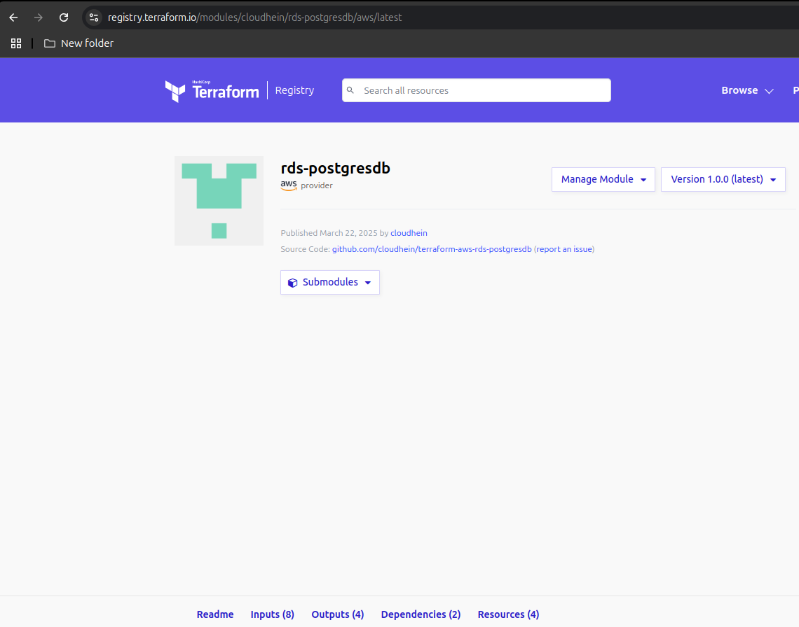

# AWS RDS Postgresdb Terraform Module
Terraform Module which creates Postgresdb using AWS managed RDS service

## Usage

```hcl
module "rds" {
  source             = "cloudhein/rds-postgresdb/aws"
  version            = "1.2.0"
  rds_storage_size   = var.rds_storage_size
  rds_storage_type   = var.rds_storage_type
  rds_instance_class = var.rds_instance_class

  rds_db_name        = var.rds_db_name
  rds_db_username    = var.rds_db_username
  rds_db_password    = var.rds_db_password

  vpc_id             = data.aws_vpc.default_vpc.id
}
```

## Standard Module Structure
```
├── LICENSE
├── main.tf
├── modules
│   └── rds
│       ├── main.tf
│       ├── outputs.tf
│       ├── README.md
│       ├── variables.tf
│       └── versions.tf
├── outputs.tf
├── README.md
├── terraform.tfvars
├── variables.tf
└── versions.tf
```
If you want to publish your module to terraform registry, it must contains following module directory structure:
1. Root Module
2. README.md
3. LICENSE
4. `main.tf,variables.tf,outputs.tf,versions.tf` file in root module
5. Variables and outputs should have descriptions
6. Nested modules should exist under the `modules/` subdirectory
   ```
   Any nested module with a README.md is considered usable by an external user. If a README doesn't exist, it is considered for internal use only.
   ```

Reference Links for Standard Module Structure : [Standard Module Structure](https://developer.hashicorp.com/terraform/language/modules/develop/structure)

## Publishing Modules
1. Create your Terraform module configuration.
2. Create a GitHub repository for your module in the following format – 
   ```
   terraform-<Provider_Name>-<Module_Name>
   ```
3. Push the content of your module configuration to the created repository.
4. Create a tag for your repository.
5. Go to the Terraform registry and sign in with GitHub.
6. Click on publish and select module.
7. Select that GitHub repository.
8. Success, your module has been published!





[My module link](https://registry.terraform.io/modules/cloudhein/rds-postgresdb/aws/latest)

